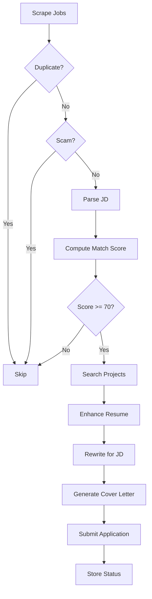

<div align="center">

# 🤖 Autonomous AI Career Agent

### *Your Intelligent Job Search Assistant*

[](https://www.python.org/downloads/)
[](https://fastapi.tiangolo.com/)
[](LICENSE)
[](https://github.com/psf/black)

**Automate your job search with AI-powered matching, resume tailoring, and application tracking**

[Features](#-features) • [Quick Start](#-quick-start) • [Documentation](#-documentation) • [API Reference](#-api-endpoints) • [Security](#-security)

</div>

---

## 📸 Screenshot

> **Beautiful Indeed-inspired Web Interface**
> 
> Access the full-featured dashboard at `http://127.0.0.1:8000` with job search, analytics, monitoring, and resume management.

---

## 🚀 What This Does

An intelligent, autonomous system that **scrapes job listings**, **analyzes them for fit**, **enhances your resume** with relevant projects, and **automates** the entire job application process with scam detection and duplicate prevention.

## 🌟 Features

- **Automated Job Scraping**: Continuously monitors multiple job platforms (LinkedIn, Indeed, Glassdoor)
- **Smart Matching**: AI-powered match scoring (0-100) based on skills, experience, and project alignment
- **Scam Detection**: Identifies suspicious job postings with red-flag analysis
- **Resume Enhancement**: Automatically finds and adds relevant open-source projects to your resume
- **Intelligent Resume Tailoring**: Rewrites resume to match each job description while maintaining truthfulness
- **Dynamic Cover Letters**: Generates personalized cover letters with 6 personality styles:
  - Professional
  - Friendly  
  - Technical
  - Direct
  - Creative
  - Relocation-friendly
- **Duplicate Prevention**: Never applies to the same job twice
- **Real-time Analytics**: Comprehensive dashboard with match score trends, top skills, and application tracking

## 🏗️ Architecture

```
FastAPI Backend ↔ LangChain Agent ↔ LLM (GPT-4/Claude)
       ↓                              ↓
   PostgreSQL/SQLite         Tool Functions:
   (Jobs, Projects,          - Job Scraping
    Applications)            - JD Parsing
                             - Match Scoring
                             - Project Search
                             - Resume Rewriting
                             - Cover Letter Generation
                             - Application Submission
```

## 📁 Project Structure

```
career_agent/
├── app/
│   ├── main.py                 # FastAPI endpoints & API routes
│   ├── agent.py                # LangChain Agent orchestration
│   ├── models.py               # Database models (SQLAlchemy)
│   ├── schemas.py              # Pydantic schemas & tool definitions
│   ├── config.py               # Configuration settings
│   ├── database.py             # Database connection
│   └── tools/
│       ├── job_tools.py        # Scraping, parsing, scam detection
│       ├── resume_tools.py     # Matching, projects, rewriting
│       ├── application_tools.py # Cover letters, submission
│       └── analytics_tools.py  # Dashboard metrics
├── test_api.py                 # API test suite
├── requirements.txt            # Python dependencies
└── README.md                   # This file
```

## ⚡ Quick Start

**Get started in 3 steps:**

### 1️⃣ Install Dependencies

```bash
# Clone the repository
git clone https://github.com/yourusername/career-agent.git
cd career-agent

# Install requirements
pip install -r requirements.txt
```

### 2️⃣ Configure (Optional)

```bash
# Copy the example environment file
cp .env.example .env

# Edit with your credentials (optional - works without it!)
# nano .env
```

**⚠️ SECURITY:** Never commit the `.env` file! It's already in `.gitignore`.

See [SECURITY.md](SECURITY.md) for detailed security guidelines.

### 3️⃣ Run the Application

```bash
# Start the server
python -m uvicorn app.main:app --reload
```

**🎉 That's it!** Open your browser and go to:

- **Web UI:** http://127.0.0.1:8000
- **API Docs:** http://127.0.0.1:8000/docs
- **Alternative Docs:** http://127.0.0.1:8000/redoc

---

## 📖 Documentation

For detailed setup and usage instructions, see:

- **[HOW_TO_RUN.md](HOW_TO_RUN.md)** - Complete setup guide with troubleshooting
- **[SECURITY.md](SECURITY.md)** - Security best practices
- **[UI_V3_ENHANCEMENTS.md](UI_V3_ENHANCEMENTS.md)** - Web interface features
- **[COMPLIANCE_REPORT.md](COMPLIANCE_REPORT.md)** - Requirements verification

## 📖 Usage Examples

### Using the REST API

#### 1. Scrape Jobs
```bash
curl -X POST "http://127.0.0.1:8000/jobs/scrape" \
  -H "Content-Type: application/json" \
  -d '{
    "region": "New York",
    "role": "Backend Engineer",
    "platforms": ["LinkedIn", "Indeed"]
  }'
```

#### 2. List Jobs (with filtering)
```bash
# Get all jobs with match score >= 75
curl "http://127.0.0.1:8000/jobs?min_match_score=75&exclude_scams=true"
```

#### 3. Get Job Details
```bash
curl "http://127.0.0.1:8000/jobs/1"
```

#### 4. Calculate Match Score
```bash
curl -X POST "http://127.0.0.1:8000/match-score" \
  -H "Content-Type: application/json" \
  -d '{
    "job_id": 1,
    "resume_text": "Your resume content here..."
  }'
```

#### 5. Generate Cover Letter
```bash
curl -X POST "http://127.0.0.1:8000/cover-letter/generate" \
  -H "Content-Type: application/json" \
  -d '{
    "job_id": 1,
    "resume_text": "Your resume...",
    "personality": "professional"
  }'
```

#### 6. Get Dashboard Stats
```bash
curl "http://127.0.0.1:8000/dashboard/stats"
```

### Using the Python Test Script

```bash
python test_api.py
```

This will run a comprehensive test suite covering all API endpoints.

### Using the LangChain Agent

```python
import requests

response = requests.post(
    "http://127.0.0.1:8000/agent/run",
    json={
        "instruction": "Scrape Python jobs in San Francisco, find high-match positions (>80), and prepare applications."
    }
)

print(response.json())
```

## 📊 API Endpoints

### Job Management
- `POST /jobs/scrape` - Scrape jobs from platforms
- `GET /jobs` - List all jobs (with filters)
- `GET /jobs/{job_id}` - Get job details
- `POST /jobs/{job_id}/analyze` - Parse and analyze a job

### Resume & Matching
- `POST /match-score` - Calculate match score
- `POST /projects/search` - Search for relevant projects
- `GET /projects` - List saved projects

### Cover Letters
- `POST /cover-letter/generate` - Generate tailored cover letter

### Analytics
- `GET /dashboard/stats` - Comprehensive metrics
- `GET /analytics/match-distribution` - Match score distribution
- `GET /analytics/timeline` - Application timeline
- `GET /applications` - List all applications

### Agent
- `POST /agent/run` - Run the autonomous agent with instructions

## 🛡️ Safety Features

1. **Scam Detection**: Flags jobs with suspicious patterns:
   - Requests for upfront payment
   - Personal email domains
   - Unrealistic salaries
   - Missing company information

2. **Duplicate Prevention**: Checks both URL and company+title combinations

3. **Dry Run Mode**: By default, applications are simulated (not actually submitted)

4. **Truthful Enhancements**: Projects added to resume are real and verifiable

## 🎯 Workflow Example



## 🔧 Customization

### Adding New Job Platforms

Edit `app/tools/job_tools.py`:

```python
def scrape_jobs(region, role, platforms):
    # Add your platform scraping logic
    if "YourPlatform" in platforms:
        # Scrape from your platform
        pass
```

### Custom Match Scoring

Modify `app/tools/resume_tools.py`:

```python
def compute_match_score(resume_text, jd_data):
    # Customize scoring algorithm
    score = 0.0
    # Your custom logic here
    return score
```

### New Cover Letter Personalities

Update `app/tools/application_tools.py`:

```python
PERSONALITY_TEMPLATES["your_style"] = {
    "opening": "...",
    "body": "...",
    "closing": "..."
}
```

## 📝 Database Schema

### Jobs Table
- `id`, `url`, `title`, `company`, `location`
- `raw_description`, `parsed_data` (JSON)
- `match_score`, `match_details` (JSON)
- `is_scam`, `scam_reason`, `status`

### Projects Table
- `id`, `name`, `description`, `url`, `source`
- `keywords` (JSON), `added_at`

### Resume Versions Table
- `id`, `content`, `created_at`

### Applications Table
- `id`, `job_id`, `resume_version_id`
- `cover_letter_text`, `personality_used`
- `status`, `submitted_at`

## 🔒 Security

This application handles **sensitive information** including API keys, email credentials, and personal data.

### ⚠️ Critical Security Guidelines:

1. **Never commit `.env` files** - Contains your API keys and passwords
2. **Never commit `.db` files** - Contains your personal job search data
3. **Use environment variables** for all secrets
4. **Enable `DRY_RUN=true`** to prevent accidental application submissions
5. **Review all generated content** before actual submission

📚 **Read [SECURITY.md](SECURITY.md) for complete security guidelines**

---

## 🤝 Contributing

We welcome contributions! Here's how you can help:

### Ideas for Enhancement:

1. **Real Scrapers** - Implement Playwright/Selenium scrapers for actual job boards
2. **API Integrations** - Integrate official APIs (LinkedIn, Indeed, Glassdoor)
3. **Email Notifications** - Alert system for high-match jobs
4. **Advanced UI** - React/Next.js dashboard with charts and analytics
5. **LLM Resume Rewriting** - Deep resume customization per job
6. **Interview Scheduling** - Automated calendar integration
7. **More Platforms** - AngelList, Remote.co, We Work Remotely
8. **Browser Extension** - One-click apply from any job page

### How to Contribute:

1. Fork the repository
2. Create a feature branch (`git checkout -b feature/AmazingFeature`)
3. Commit your changes (`git commit -m 'Add AmazingFeature'`)
4. Push to the branch (`git push origin feature/AmazingFeature`)
5. Open a Pull Request

**Before submitting:**
- ✅ Test your changes thoroughly
- ✅ Update documentation
- ✅ Check for secrets in code
- ✅ Follow existing code style
- ✅ Add tests if applicable

---

## 📝 License

This project is licensed under the MIT License - see the [LICENSE](LICENSE) file for details.

---

## ⚠️ Disclaimer

**Important Legal and Ethical Considerations:**

- This tool is for **educational and research purposes**
- Always **review applications** before submission
- **Respect platform terms of service** - automated scraping may violate ToS
- Use **responsibly and ethically**
- The authors are **not responsible** for misuse or violations
- Some job platforms have **rate limits and anti-bot measures**

### Recommended Ethical Usage:

✅ **DO:**
- Use for personal job search organization
- Test and validate AI-generated content
- Learn about automation and AI agents
- Use with platforms that allow automation

❌ **DON'T:**
- Spam applications to inappropriate positions
- Submit without reviewing generated content
- Violate platform terms of service
- Use for fraudulent purposes
- Overwhelm employers with low-quality applications

---

## 🙏 Acknowledgments

Built with:
- [FastAPI](https://fastapi.tiangolo.com/) - Modern web framework
- [LangChain](https://langchain.com/) - AI agent orchestration
- [SQLAlchemy](https://www.sqlalchemy.org/) - Database ORM
- [Playwright](https://playwright.dev/) - Browser automation
- [OpenAI](https://openai.com/) - Language models

---

## 📞 Support

- 📖 Check [HOW_TO_RUN.md](HOW_TO_RUN.md) for detailed setup instructions
- 🐛 Report bugs via [GitHub Issues](https://github.com/yourusername/career-agent/issues)
- 💡 Request features via [GitHub Issues](https://github.com/yourusername/career-agent/issues)
- 🔒 Report security vulnerabilities privately (see [SECURITY.md](SECURITY.md))

---

<div align="center">

**Made with ❤️ for job seekers everywhere**

⭐ **Star this repo if you find it helpful!** ⭐

</div>
