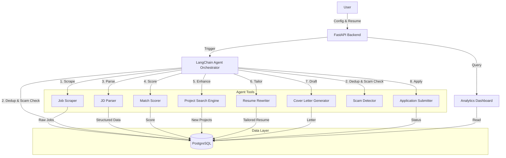

# Autonomous AI Job Application & Career Agent Architecture

## High-Level Architecture

## Component Breakdown

1.  **FastAPI Backend**: Serves as the entry point for the user to configure the agent (region, role, resume) and view the dashboard. It triggers the background agent workflows.
2.  **PostgreSQL Database**: The central source of truth. Stores job listings, parsed data, match scores, project metadata, generated resumes/cover letters, and application statuses.
3.  **LangChain Agent**: The brain of the operation. It follows a cyclic graph or a linear chain to process jobs from scraping to application. It utilizes an LLM (e.g., GPT-4, Claude 3.5) to make decisions and call tools.
4.  **Tools**:
    *   **Scraping**: Python scripts (Selenium/Playwright/BeautifulSoup) to fetch jobs.
    *   **Analysis**: LLM-based parsing and scoring.
    *   **Content Generation**: LLM-based resume rewriting and cover letter generation.
    *   **External Search**: APIs (GitHub, Arxiv) or scraping to find relevant projects.
    *   **Submission**: Browser automation to fill forms.

## Data Flow

1.  **Ingestion**: Jobs are scraped and stored in `jobs` table.
2.  **Filtering**: Deduplication checks `jobs` table. Scam detection analyzes text/metadata.
3.  **Processing**: Valid jobs are parsed. Match score is calculated.
4.  **Enhancement**: If match > threshold, relevant projects are fetched and added to a temporary resume context.
5.  **Generation**: Resume is rewritten. Cover letter is generated.
6.  **Action**: Application is submitted. Status is updated in `applications` table.
7.  **Monitoring**: Dashboard queries `jobs` and `applications` tables for real-time stats.
